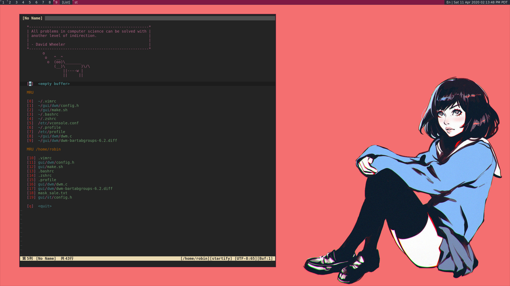

# My dwm (dynamic window manager) build

 
Dwm is an extremely fast, small, and dynamic window manager for X.  This is my personal build of dwm.  I used a number of patches in this build to make dwm more "sensible" rather than "suckless." The patches I added to this build include:
+ alpha (for transparency)
+ attachaside (new clients appear in the stack rather than as the master)
+ restartsig (allows dwm to be restarted with a keybinding)
+ statuspadding (horizontal and vertical padding in the status bar are now configurable options)
+ uselessgap (adding gaps when more than one window)
+ bartabgroups (show tabs in title bar section for all windows in the current tag)

# Setup

    ./make.sh bootstrap
    ./make.sh install
    ./make.sh font

# Keybinding

    modify the ~/.config/sxhkd/sxhkdrc file to use your selected browser and terminals etc
    to mimic my current keyboard uses, add the following line into your ~/.bashrc

    # check more binding info using : grep alt /usr/share/X11/xkb/rules/evdev.lst | grep win
    setxkbmap -option "altwin:swap_alt_win"
    setxkbmap -option "caps:escape"

# My DWM built-in Keybindings

The MODKEY is set to the Win/Super/Command key. 

| Keybinding | Action |
| :--- | :--- |
| `MODKEY + RETURN` | opens terminal (alacritty is the terminal but can be easily changed) |
| `MODKEY + SHIFT + RETURN` | opens run launcher (dmenu is the run launcher but can be easily changed) |
| `MODKEY +  q` | quit application with focus |
| `MODKEY +  w` | untag current window from current tag |
| `MODKEY +  f` | toggle monocle mode to maximize the current window |
| `MODKEY +  z` | set the current window to be first one in list |
| `MODKEY +  b` | toggle statur bar at the top |
| `MODKEY + SHIFT + r` | restarts dwm |
| `MODKEY + 1-9` | switch focus to workspace (1-9) |
| `MODKEY + SHIFT + 1-9` | tag current window with the new tag and switch to the tag (1-9) |
| `Super  + SHIFT + 1-9` | send focused window to workspace (1-9) |
| `MODKEY + j` | focus stack +1 (switches focus between windows in the stack) |
| `MODKEY + k` | focus stack -1 (switches focus between windows in the stack) |
| `MODKEY + SHIFT + j` | move the window position down in the list of current tag |
| `MODKEY + SHIFT + k` | move the window position up in the list of current tag |
| `MODKEY + .` | focusmon +1 (switches focus next monitors) |
| `MODKEY + ,` | focusmon -1 (switches focus to prev monitors) |
| `MODKEY + h` | setmfact -0.05 (expands size of window) |
| `MODKEY + l` | setmfact +0.05 (shrinks size of window) |
| `MODKEY + u` | increase the number of windows in master tile (left side of the screen) |
| `MODKEY + d` | decrease the number of windows in master tile (left side of the screen) |
| `MODKEY + LeftMouse` | make the window float to where mouse moves |
| `MODKEY + RightMouse` | make the window float and rezie the window |
| `MODKEY + MiddleMouse` | toggle the floating mode of the focused window |
| `MODKEY + SHIFT + f `  | toggle the floating mode of the focused window |

# Running dwm

If you do not use a login manager (like lightdm) then you can add the following line to your .xinitrc to start dwm using startx:

    exec dwm
	
If you use a login manager (like lightdm), make sure that you have a file called dwm.desktop in your /usr/share/xsessions/ directory.  It should look something like this:

	[Desktop Entry]
	Encoding=UTF-8
	Name=Dwm
	Comment=Dynamic window manager
	Exec=dwm
	Icon=dwm
	Type=XSession

# Adding an autostart file

DWM has been patched in such a way that it looks for an autostart file at: $HOME/.config/dwm/autostart.sh

You will need to create this file and the directory that it is located.  An example autostart.sh is included below:

	#! /bin/bash 
    pkill sxhkd
    sxhkd & # for additional keybinding
    xsetroot -s 'top right corner status bar display'
